# ⚔️ Les Gardiens de la Lame Éternelle - Acte I

## Diagramme de flux narratif

```mermaid
graph TD
    %% PHASE 1 : CONTEXTES DIFFÉRENCIÉS (7 branches)
    
    %% Branche Sanctuaire (Route principale)
    A1[acte1_debut - TEXT] --> A2[acte1_sanctuaire_reconnaissance - TEXT]
    A1 --> A3[acte1_sanctuaire_infiltration - TEXT]
    
    %% Branche Nids d'Ombres (Action)
    B1[acte1_nids_debut - TEXT] --> B2[acte1_nids_assault - COMBAT]
    B1 --> B3[acte1_nids_sauvetage - TEXT]
    
    %% Branche Réfugiés (Responsabilité)
    C1[acte1_refugies_debut - TEXT] --> C2[acte1_refugies_defense - TEXT]
    C1 --> C3[acte1_refugies_enquete - DIALOGUE]
    
    %% Branche Mage (Mystère)
    D1[acte1_mage_debut - TEXT] --> D2[acte1_mage_cartes - TEXT]
    D1 --> D3[acte1_mage_lame - DIALOGUE]
    
    %% Branche Pont (Passage)
    E1[acte1_pont_debut - TEXT] --> E2[acte1_pont_reconnaissance - TEXT]
    E1 --> E3[acte1_pont_contournement - TEXT]
    
    %% Branche Solo (Isolement)
    F1[acte1_solo_debut - TEXT] --> F2[acte1_solo_confiance - DIALOGUE]
    F1 --> F3[acte1_solo_fouille - TEXT]
    
    %% Branche Ruines (Secrets)
    G1[acte1_ruines_debut - TEXT] --> G2[acte1_ruines_artefact - TEXT]
    G1 --> G3[acte1_ruines_symboles - TEXT]
    
    %% Convergences vers les fils narratifs principaux
    A2 --> CONV1[acte1_convergence_investigation]
    A2 --> CONV2[acte1_convergence_action]
    A3 --> CONV1
    A3 --> CONV2
    
    B2 --> CONV2
    B3 --> CONV1
    B3 --> CONV2
    
    C2 --> CONV1
    C2 --> CONV2
    C3 --> CONV1
    C3 --> CONV2
    
    D2 --> CONV1
    D2 --> CONV2
    D3 --> CONV1
    D3 --> CONV2
    
    E2 --> CONV1
    E2 --> CONV2
    E3 --> CONV1
    E3 --> CONV2
    
    F2 --> CONV3[acte1_convergence_solo]
    F2 --> CONV1
    F3 --> CONV1
    F3 --> CONV3
    
    G2 --> CONV1
    G2 --> CONV2
    G3 --> CONV1
    G3 --> CONV2
    
    %% Style des nœuds
    classDef textScene fill:#e1f5fe
    classDef dialogueScene fill:#f3e5f5
    classDef interactiveScene fill:#e8f5e8
    classDef merchantScene fill:#fff3e0
    classDef combatScene fill:#ffebee
    classDef restScene fill:#f1f8e9
    classDef convergence fill:#fff9c4
    
    class A1,A2,A3,B1,B3,C1,C2,D1,D2,E1,E2,E3,F1,F3,G1,G2,G3 textScene
    class C3,D3,F2 dialogueScene
    class B2 combatScene
    class CONV1,CONV2,CONV3 convergence
```

## Structure de l'Acte I

### Phase 1 : Contextes différenciés
Chaque branche du prologue donne une **saveur narrative unique** avec 2-3 scènes de contexte :

1. **acte1_debut** (Sanctuaire) - Investigation du sanctuaire corrompu
2. **acte1_nids_debut** (Nids) - Urgence face aux créatures proliférantes  
3. **acte1_refugies_debut** (Réfugiés) - Responsabilités envers les survivants
4. **acte1_mage_debut** (Mage) - Révélations sur les mystères anciens
5. **acte1_pont_debut** (Pont) - Contrôle d'un passage stratégique
6. **acte1_solo_debut** (Solo) - Défis de l'isolement et méfiance
7. **acte1_ruines_debut** (Ruines) - Secrets d'une civilisation perdue

### Phase 2 : Convergence vers 3 fils narratifs
1. **Fil Investigation** (`acte1_convergence_investigation`) - Focus mystères, lore, et recherche
2. **Fil Action** (`acte1_convergence_action`) - Focus combat, urgence, et intervention directe  
3. **Fil Solo** (`acte1_convergence_solo`) - Focus débrouillardise, survie et choix difficiles

## Statistiques
- **Total scènes Phase 1** : 21 scènes (7 branches × 3 scènes moyenne)
- **Types utilisés** : 15 TEXT, 5 DIALOGUE, 1 COMBAT
- **Points de convergence** : 3 fils narratifs principaux
- **Flags créés** : 25+ pour tracking des choix et conséquences

## Avancement
- ✅ Les 7 branches complètes (21 scènes)
- ✅ Points de convergence définis  
- ⏳ Scènes de convergence à écrire prochainement