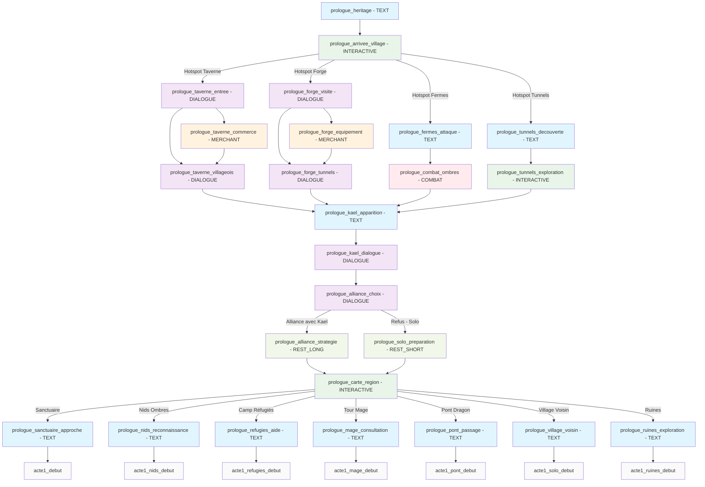

# 🗡️ Les Gardiens de la Lame Éternelle - Prologue

## Diagramme de flux narratif

## Légende des phases

- **Phase 1** : Arrivée et présentation du contexte (heritage → village)
- **Phase 2** : Investigation libre du village (4 hotspots avec sous-branches)
- **Phase 3** : Rencontre avec Kael (convergence narrative)
- **Phase 4** : Dialogue et choix d'alliance (2 options : Alliance OU Solo)
- **Phase 5** : Préparation selon alliance choisie
- **Phase 6** : Exploration de la région (carte unifiée avec variations)
- **Finales** : 7 destinations vers l'Acte I selon les choix

## Types de scènes utilisées

- **TEXT** : 11 scènes narratives (heritage, fermes, apparition Kael, destinations finales)
- **DIALOGUE** : 6 scènes d'interaction (taverne, forge, Kael, choix alliance)  
- **INTERACTIVE** : 3 scènes avec hotspots (village, tunnels souterrains, carte région unifiée)
- **MERCHANT** : 2 scènes commerciales (taverne, forge)
- **COMBAT** : 1 scène de combat (ombres des fermes)
- **REST_LONG/SHORT** : 2 scènes de repos stratégiques (alliance longue OU solo courte)

## Fonctionnalités narratives intégrées

### ✅ Système de réputation
- Ravenscroft, Kael, Fermiers, Réfugiés, Érudits

### ✅ Système de connaissances 
- 25+ entrées knowledge pour suivre les découvertes

### ✅ Gestion d'objets conditionnels
- Clé du sanctuaire, lanterne, épées, artefacts

### ✅ Conditions dynamiques
- Choix bloqués selon équipement/connaissances

### ✅ Conséquences à long terme
- Choices impactent les scènes futures et l'Acte I

### ✅ Embranchements multiples
- 7 fins différentes menant à différents débuts d'Acte I

**Total : 25 scènes** pour un prologue complet avec rejouabilité maximale.

## Points de départ pour l'Acte I

1. **acte1_debut** - Via sanctuaire (route principale)
2. **acte1_nids_debut** - Via nids d'ombres (action)  
3. **acte1_refugies_debut** - Via camp réfugiés (responsabilité)
4. **acte1_mage_debut** - Via tour du mage (mystère)
5. **acte1_pont_debut** - Via pont dragon (exploration)
6. **acte1_solo_debut** - Via village abandonné (isolation)
7. **acte1_ruines_debut** - Via ruines anciennes (secrets)